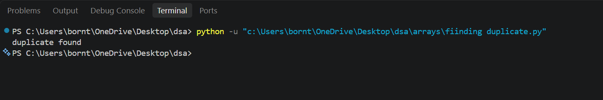

# DSA-PYTHON

My journey learning **Data Structures and Algorithms with Python**.

This repository contains my practice problems, implementations, and notes as I learn DSA from the basics.

## 📚 Topics

* Big O Notation
* Arrays / Lists
* Searching
* Sorting
* Recursion
* Stacks
* Queues
* Linked Lists
* Trees
* Graphs
* Hashing
* More to come...

## 🎯 Goal

Build a strong foundation in DSA and improve my problem-solving skills through consistent practice.

## 🐍 Language

**Python**

## 🧠 Problems

### 1. Finding Duplicates

A simple practice problem to detect whether a list contains duplicate elements.

**Code:** [View Python File](finding_duplicate.py)

**Screenshot:**

## 📈 Progress

Currently learning the fundamentals and solving problems step by step.

---

> Learning. Practicing. Improving.
